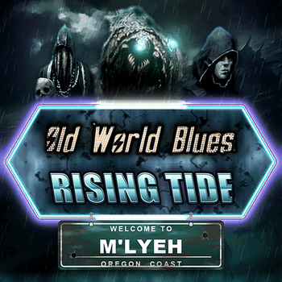

# OWB - Rising Tide

*A submod for [Old World Blues](https://steamcommunity.com/sharedfiles/filedetails/?id=2265420196), for the Mirelurk Tribe (`MLT`).*

Most submods try to be expansions. This one takes a single nation — one of the strangest in Old
World Blues — and spends all of its effort on making that nation feel finished.

You play the Mirelurk Tribe from the moment M'lulu is crowned. Five **Books of M'lyeh** are scattered
across the Pacific coast; each one has to be reached, by conquest or by a spy standing in the right
place, and each sends back an expedition that costs you something before it gives up its pages. What
the Books open is a column of ritual: gifts from the deep that you switch on and off, two creature
units you **summon rather than build** and pay for in your own people, and two great rituals that tax
every province you hold for as long as they run.

Once the Deep Ones walk, the column runs on as a **story in five acts**, one chapter after another
down a single spine, with the second great ritual among them. Your priesthood founds an intelligence
agency, the Esoteric Order of M'lyeh, and turns it on Old World Blues' own great wars — the Brotherhood
in Washington, the NCR and the Hoover Dam, Caesar's Legion, Lost Hills, Heaven's Guard, the Utah road
war, Texas, Nuevo Aztlán and Tlaloc. The acts spy on, rob and bleed their targets before they declare
their wars, and from the NCR on the next chapter opens only when the great war is won. Two of the
northern peoples need not be fought at all: the Broken Coast and the Bone Dancers can be courted into
a faction of your own. At the bottom R'lyeh rises from the sea, and the campaign closes on one of
three endings.

Meanwhile **cults of M'lyeh** take root abroad — grown by your operatives, withering if you neglect
them, and rising to sabotage their own country if it ever goes to war with you. They can be called on
for recruits or for smuggled arms. The **Wet Market** gives you a seat of your own in OWB's trade
ledger, selling mirelurks to anyone with caps.

The tribe also gets its own main menu, an animated M'lulu, and an AI that plays the whole thing when
you are someone else's neighbour.

**[Steam Workshop](https://steamcommunity.com/sharedfiles/filedetails/?id=3798403425)** —
requires Old World Blues, loaded **above** this mod.

**Status:** early release. The ritual column, the creature units and the main menu have been played;
the story acts, the cults, the Wet Market and the AI are new and lightly tested. Bug reports
are welcome.

Only `mod_folder/` ships. Everything else — design notes, tunables, the build scripts, the override
and encoding rules, the OWB update process and known conflicts — is in [`CLAUDE.md`](CLAUDE.md).

### Ideas

- Bespoke focus icons, instead of the reused Old World Blues ones.
- Retheme some of the UI in the tribe's colours — murky green and abyssal violet, maybe moss and
  seaweed on the frames.
- A properly repainted M'lulu portrait; the one that ships is a colour grade of OWB's.
- Cult-flavoured operation phases, and a decision-category banner of our own.
